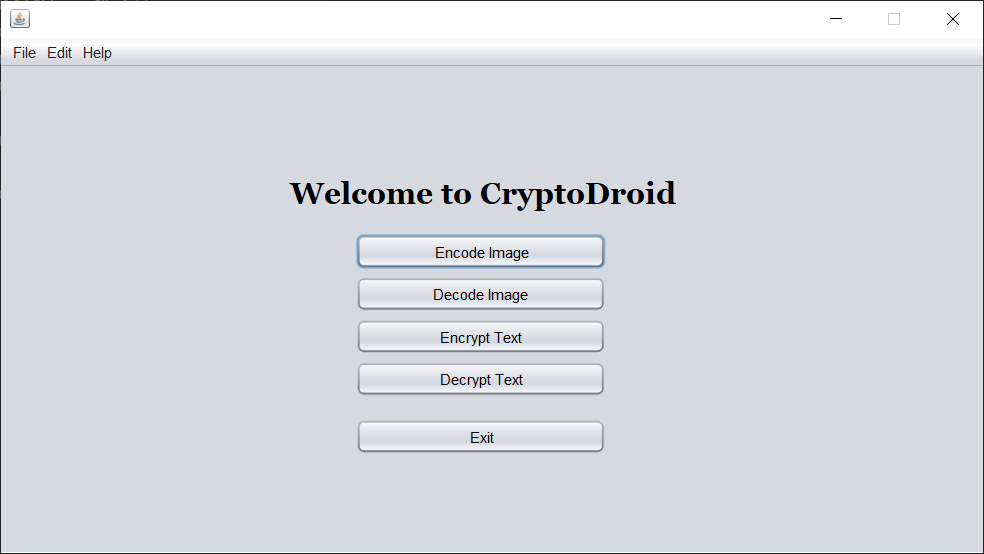
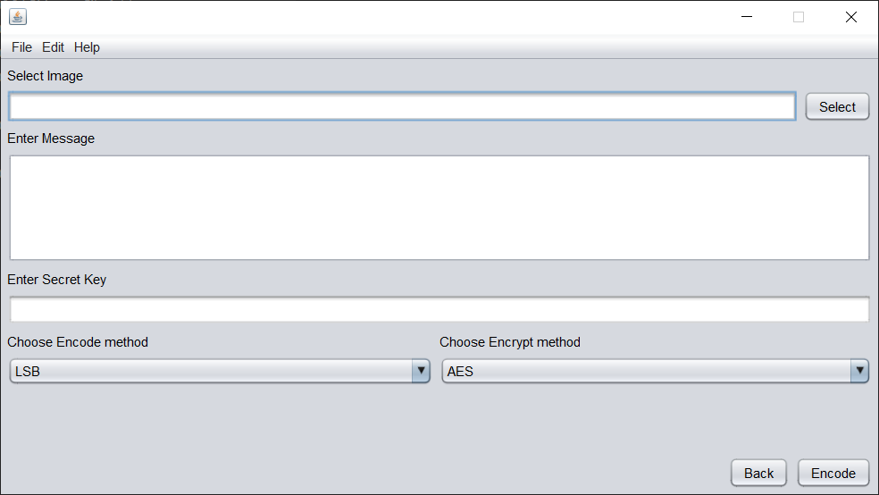
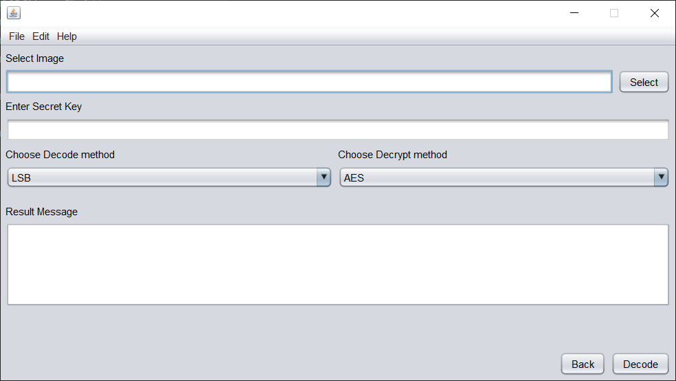
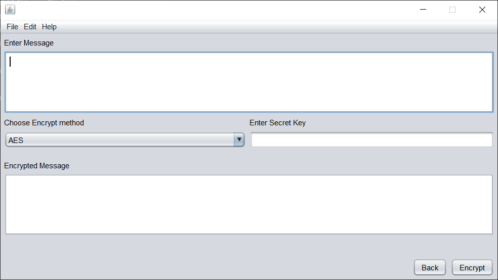
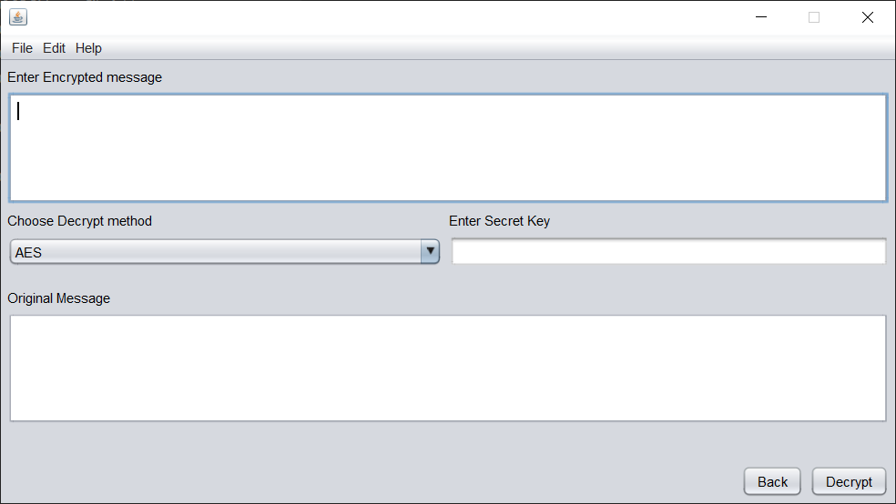

# Digital Steganography

### What is it about?

In this project, we are planning to make the process of Digital Steganography
even more secure and safe by introducing the concept of cryptography. By the use of cryptography, the secret message is encrypted using a private key before encoding into the steganography medium (image file) and transmitted to the receiver. The message is decoded from the steganography medium in encrypted form (ciphertext) and decrypted using a private key to get the original message on the receiver's end.

# Modules

There are mainly two modules in this project, namely steganography,
cryptography. We have identified two algorithms for each of the modules.

### Steganography

- Least Significant Bit (LSB) substitution
- Discrete Cosine Transform (DCT)

### Cryptography

- Advanced Encryption Standard (AES)
- Rivest, Shamir, Adleman (RSA)

# How to Run

To run the project from the command line, go to the [dist](https://github.com/Akshayasaran/Digital-Steganography/tree/main/dist) folder and
type the following:

```bash
java -jar "Digital_Steganography.jar"
```

This project is build using Netbeans 8.2 RC.

# ScreenShots







